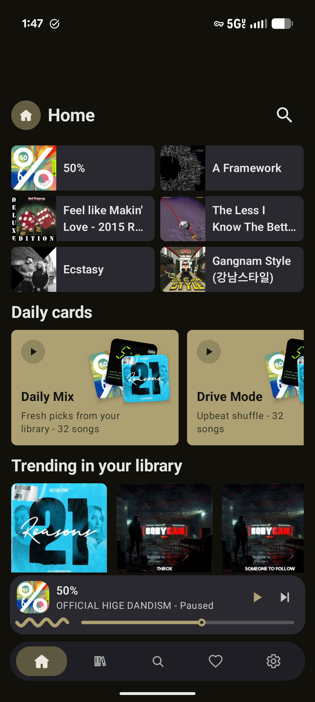
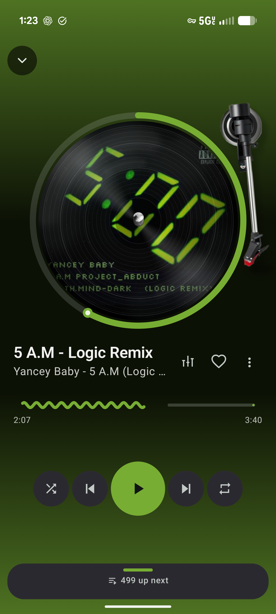
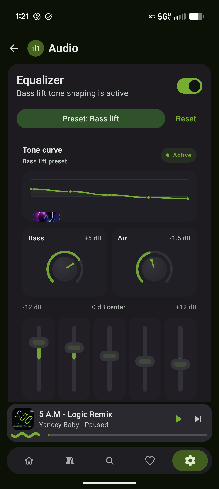

# Jellyfin Music

Jellyfin Music is a FOSS native Android music player for Jellyfin.

The goal is a simple, clean, Material You music app with fast library browsing, reliable Jellyfin playback, playful turntable-inspired player controls, and home-screen widgets.

## Status

This is an early prototype. It already connects to a Jellyfin server and plays real music, but the architecture, UI, and playback features are still moving quickly.

## Features

- Kotlin and Jetpack Compose Android app.
- Material You themed UI with dynamic color on Android 12+.
- Jellyfin server login with saved session.
- Real song library loading from the Jellyfin API.
- Search plus songs, albums, and artists library views.
- Full-screen player with turntable-inspired vinyl artwork, disc scratch seeking, animated visualizer bars, wavy seek, shuffle, repeat, auto-next, play, pause, and replay.
- Rounded icon playback controls.
- Home-screen widgets: a vinyl-inspired 4x2 player card and a compact 2x1 mini widget.
- App label and package identity set to `Jellyfin Music`.

## Screenshots

Screenshots are tracked under:

```text
docs/screenshots/
```

Current release screenshots:

| Home | Now Playing | Audio |
| --- | --- | --- |
|  |  |  |

## Roadmap

- Improve Jellyfin auth and connection error handling.
- Add album art from Jellyfin image endpoints.
- Add proper queue management.
- Add playlist and favorite support.
- Add notification/media-session controls.
- Add offline caching.
- Add accessibility labels and larger-screen layout polish.
- Study Finamp and Gelli for proven Jellyfin music workflows.

## Local Build

Requirements:

- JDK 17
- Android SDK

```bash
./gradlew assembleDebug
```

The debug APK is written to:

```text
app/build/outputs/apk/debug/app-debug.apk
```

## Play Store Build

Release builds no longer use the debug signing key. To create a Play-ready App Bundle, copy `keystore.properties.example` to `keystore.properties`, fill in your upload key values, then run:

```bash
./gradlew verifyPlayReleaseSigning bundleRelease
```

The App Bundle is written to:

```text
app/build/outputs/bundle/release/app-release.aab
```

Play Store checklist drafts live in:

```text
docs/play-store-readiness.md
docs/privacy-policy.md
```

The current shareable release APK, icon images, and release screenshots are tracked under:

```text
release-assets/1.1.7-v12/
```

## Contributing

Contributions are welcome. See [CONTRIBUTING.md](CONTRIBUTING.md).

## Security

Do not post private server URLs, tokens, passwords, or personal media-library details in public issues. See [SECURITY.md](SECURITY.md).

## License

Jellyfin Music is released under the [MIT License](LICENSE).
